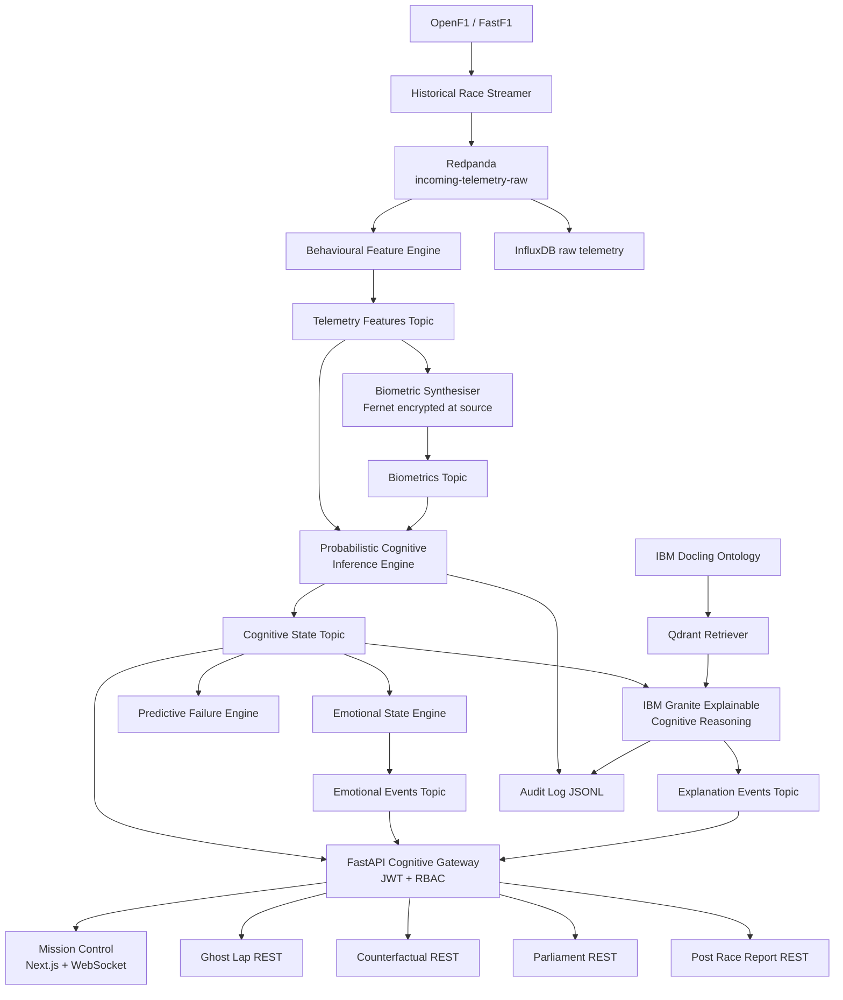

# NeuroPit


[](https://github.com/vighriday/NeuroPit/actions/workflows/ci.yml)
[](https://www.apache.org/licenses/LICENSE-2.0)
[](https://github.com/ibm-granite-community)
[](https://www.docling.ai)
[](https://www.langflow.org)
[](tests/)

> Real time Cognitive Twin Operating System for motorsport. Telemetry is infrastructure. Cognition is the product.

NeuroPit is a probabilistic human state inference system for Formula racing. It does not optimise the car. It infers the driver. Built for the IBM AI Builders Challenge powered by IBM SkillsBuild.

---

## The problem

Modern Formula teams measure the car in extraordinary detail. They measure almost nothing about the driver. The pit wall sees laptimes, tyre temperatures, and brake bias positions, but it does not see whether the driver is mentally overloaded, whether confidence is collapsing, or whether panic is starting to accumulate after a near miss.

A driver who has just survived a wet braking incident at three hundred kilometres per hour does not return to a neutral mental state on the next straight. Their steering becomes microscopically less stable. Their throttle commitment drops. Their heart rate variability tightens. These changes are invisible to the dashboard but they are present in the telemetry the car is already producing.

That is the gap.

## The solution

NeuroPit treats the driver as a probabilistic cognitive entity that can be inferred from racing telemetry the team is already collecting. Every evaluation tick produces a nine score Cognitive Twin, a nine emotion distribution, a discrete persona label, a confidence band, an IBM Granite reasoning paragraph grounded in the motorsport cognition ontology, and a full audit trail.

Other systems ask what is happening to the car. NeuroPit asks what is happening to the human nervous system operating the car. The category is Human Machine Cognitive Intelligence for Motorsport.

## What NeuroPit is not

- Not a telemetry analytics dashboard.
- Not a strategy copilot.
- Not a generic AI racing assistant.

NeuroPit is a Cognitive Twin Operating System. The dashboard, the REST endpoints, and the WebSocket are surfaces over the twin. They are not the product.

---

## Core capabilities

| Capability | Module |
| --- | --- |
| Behavioural telemetry feature extraction | `src/backend/feature_engineering/signal_processor.py` |
| Probabilistic Cognitive Inference Engine (nine score twin) | `src/backend/inference/cognitive_engine.py` |
| Emotional State Engine (nine emotion distribution) | `src/backend/inference/emotional_state.py` |
| Persona Drift state machine | `src/backend/common/persona.py` |
| Predictive Failure Engine across four horizons | `src/backend/prediction/failure_engine.py` |
| Ghost Lap AI (cognitive normalised laps) | `src/backend/simulation/ghost_lap.py` |
| Counterfactual Simulation Engine | `src/backend/simulation/counterfactual.py` |
| Multi Agent Strategy Parliament | `src/backend/strategy/parliament.py` |
| IBM Granite explainable cognitive reasoning | `src/backend/reasoning/granite_client.py` |
| IBM Docling motorsport cognition ontology | `src/backend/knowledge/docling_compiler.py` |
| Qdrant retriever for grounded reasoning | `src/backend/knowledge/retriever.py` |
| Trust and uncertainty layer | `src/backend/common/uncertainty.py` |
| Audit log per cognitive decision | `src/backend/common/audit.py` |
| Post race intelligence reporting | `src/backend/reporting/post_race.py` |
| JWT cognitive gateway with role based access | `src/backend/api/gateway.py` |
| Fernet biometric encryption at the source | `src/backend/security/crypto.py` |
| Mission Control surface (Next.js) | `src/frontend/app/` |

## The full Cognitive Twin

Every evaluation tick produces the nine score twin:

- Stress score
- Confidence score
- Fatigue score
- Cognitive load score
- Attention stability
- Strategic reliability
- Panic probability
- Emotional drift score
- Tunnel vision probability

Plus a discrete persona label (Panic, Aggressive, Fatigue, Defensive, Flow State, Recovery), a nine emotion probability distribution, and a `high` / `moderate` / `unstable` confidence band that travels with every emission.

## IBM AI integration

| Tool | Role in NeuroPit |
| --- | --- |
| **IBM Granite** | Explainable cognitive reasoning. The Granite client runs the open source community models locally through Hugging Face transformers by default. Watsonx.ai cloud is available as an optional fallback. A deterministic templated stub ensures Mission Control never goes dark. |
| **IBM Docling** | Motorsport cognition knowledge compiler. Ingests FIA reports, neuroscience papers, telemetry manuals, and historical race documents into the Qdrant `motorsport_ontology` collection used to ground every Granite reasoning call. |
| **Langflow** | Reference orchestration flow at `orchestration/langflow/neuropit_strategy_flow.json`. Visualises the cognitive strategy pipeline. |

The cognitive pipeline calls Granite with **physics first reasoning**: every score the model sees has already been computed deterministically from the engineered features. Granite is strictly forbidden from inventing cognitive numbers. It only explains them.

---

## System architecture



Telemetry flows in. The Cognitive Twin flows out. Every emission carries a confidence band, a written explanation, and an audit trail.

---

## Quick start

Requires Python 3.11+, Node 20+, and Docker.

```bash
git clone https://github.com/vighriday/NeuroPit.git
cd NeuroPit
cp .env.example .env

make install
make infra-up           # Redpanda + InfluxDB + Qdrant in Docker
make bootstrap          # Kafka topics + Qdrant collections

make backend            # terminal 1: cognitive pipeline workers
make gateway            # terminal 2: FastAPI cognitive gateway
make stream             # terminal 3: playback historical session

cd src/frontend && npm install && npm run dev
```

Open `http://localhost:3000`. Within ten seconds the cognitive trajectory starts streaming.

### Tech stack

| Layer | Technology |
| --- | --- |
| Frontend | Next.js 14, React 18, TypeScript, Tailwind, Recharts, Lucide |
| Gateway | FastAPI, WebSocket, JWT (python-jose), Fernet (cryptography) |
| Cognitive pipeline | Python 3.12, NumPy, SciPy, scikit-learn |
| Streaming | Redpanda (Kafka compatible), confluent-kafka |
| Time series | InfluxDB 2 |
| Vector store | Qdrant + sentence-transformers |
| Reasoning | IBM Granite via Hugging Face transformers (local) or watsonx.ai (cloud) |
| Knowledge | IBM Docling |
| Orchestration | Langflow reference flow |
| Telemetry source | OpenF1 + FastF1 |

---

## Why this matters

Every Formula team already pays seven figures a year for telemetry analytics. None of them, today, has a credible cognitive twin of the driver. NeuroPit closes that gap with an interpretable, audited, explainable architecture that a strategist can defend in a stewards meeting.

The same abstraction generalises beyond Formula racing into aviation, defence, surgery, esports, and elite athletics. Anywhere a trained human nervous system operates a high stakes machine, the Cognitive Twin Operating System pattern applies.

## Tests

```bash
make test              # 104 unit tests, no infrastructure required
make integration       # smoke tests, requires Redpanda running
```

CI runs the backend unit suite and the frontend type check on every push and every pull request.

## Roadmap

- **Phase 1 (shipped, v0.3.0):** Full nine score Cognitive Twin, Emotional State Engine, all PRD layers, JWT gateway, Mission Control surface, OSS community files, GitHub Actions CI.
- **Phase 2:** Statistical adaptation. Rolling baselines, telemetry normalisation, adaptive thresholds per driver.
- **Phase 3:** Learned behavioural models. Lightweight temporal classifiers on the existing feature inputs without changing the cognitive twin output contract.
- **Phase 4:** Multimodal cognitive transformer. Reinforcement learning. Personalised driver twins. Live wearable biometrics replacing the synthetic stream.

The architecture is built so each phase swaps the inference function without rewriting the surface contract.

## Documentation

- [Architecture](docs/ARCHITECTURE.md)
- [Cognitive methodology and weights](docs/COGNITIVE_METHODOLOGY.md)
- [Kafka event taxonomy](docs/EVENT_TAXONOMY.md)
- [Changelog](CHANGELOG.md)
- [Contributing](CONTRIBUTING.md)
- [Security policy](SECURITY.md)
- [Code of conduct](CODE_OF_CONDUCT.md)

## Licence

Apache 2.0. See [`LICENSE`](LICENSE) and [`NOTICE`](NOTICE) for attributions.

## Acknowledgements

NeuroPit was conceived, designed, and built for the IBM AI Builders Challenge powered by IBM SkillsBuild. The project relies on FastF1, OpenF1, IBM Granite, IBM Docling, Langflow, Redpanda, InfluxDB, Qdrant, FastAPI, and Next.js.
