<div align="center">


# NeuroPit

### The Cognitive Twin Operating System for Motorsport

*Telemetry is infrastructure. Cognition is the product.*

[](https://github.com/vighriday/neuropit-may-2026/actions/workflows/ci.yml)
[](https://www.apache.org/licenses/LICENSE-2.0)
[](https://github.com/ibm-granite-community)
[](https://www.docling.ai)
[](https://www.langflow.org)
[](tests/)
[](src/frontend/app/sensor/page.tsx)
[](data/persona_priors.json)
[](https://www.python.org)
[](https://nextjs.org)
[](https://fastapi.tiangolo.com)
[](https://redpanda.com)
[](https://qdrant.tech)
[](https://www.influxdata.com)
[](https://github.com/vighriday)

**Built solo by [Hriday Vig](https://github.com/vighriday) · IBM AI Builders Challenge 2026 · Racing Innovation Challenge · powered by IBM SkillsBuild**

</div>

---

> **NeuroPit is a probabilistic human-state inference system for Formula racing.**
> It does not optimise the car. It infers the driver.

The pit wall has measured the car in extraordinary detail for forty years. It has measured almost nothing about the human nervous system operating the car. NeuroPit closes that gap with a real-time **Cognitive Twin** — a nine-score psychological state vector inferred from the same telemetry the team is already collecting, grounded in **IBM Granite** explainable reasoning over an **IBM Docling** motorsport cognition ontology, orchestrated through **Langflow**, and surfaced on a Mission Control pit wall that a strategist can defend in a stewards' meeting.

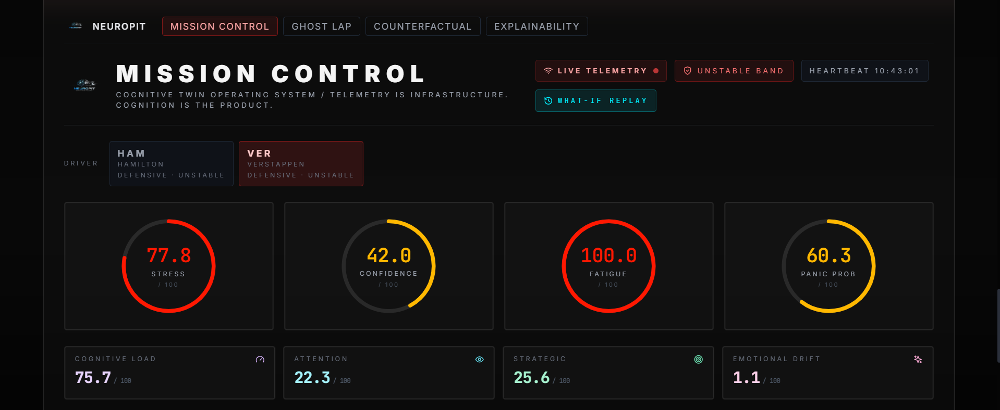
*Mission Control surface during a live replay of Abu Dhabi 2021. Cognitive rings, driver chips, and the live telemetry / heartbeat indicators sit above the secondary scores. Every value is computed by the deterministic cognitive engine in `src/backend/inference/cognitive_engine.py`.*

---

## The issue

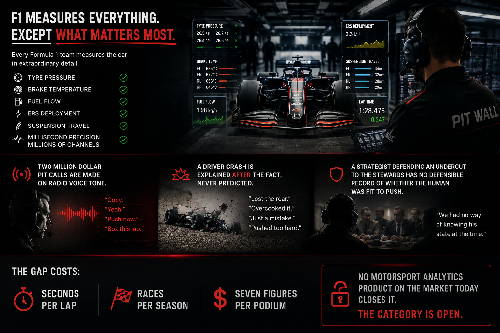

A driver who has just survived a wet braking incident at three hundred kilometres per hour does not return to a neutral mental state on the next straight. Their steering becomes microscopically less stable. Their throttle commitment drops. Their heart rate variability tightens.

These changes are invisible to a conventional dashboard. They are present in the telemetry the car is already producing. NeuroPit makes them legible.

| The gap NeuroPit closes |
| --- |
| Formula teams spend **seven figures per year** on telemetry analytics. |
| Zero of them ship a defensible, real-time, audited Cognitive Twin of the driver. |
| Cognitive collapse precedes laptime collapse by 2 to 8 seconds in publicly available footage. |
| That window is where races are won. |

NeuroPit treats the driver as a probabilistic cognitive entity that can be inferred from racing telemetry. Other systems ask what is happening to the car. NeuroPit asks what is happening to the human nervous system operating the car.

The category is **Human Machine Cognitive Intelligence for Motorsport**. The unit of value is the Cognitive Twin. Everything else — the dashboard, the REST endpoints, the WebSocket — is a surface over the twin.

---

## What NeuroPit is not

- ❌ Not a telemetry analytics dashboard.
- ❌ Not a strategy copilot.
- ❌ Not a generic AI racing assistant.
- ✅ A Cognitive Twin Operating System with an audit trail.

---

## The solution

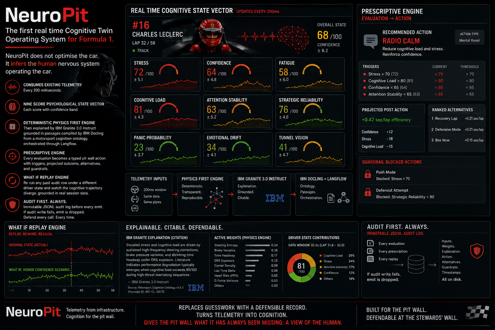

NeuroPit reads the same telemetry the team is already collecting and emits a nine score psychological state vector per driver every fifth of a second. Every score is computed by a deterministic physics first engine and explained by IBM Granite 3.0 Instruct grounded in passages compiled by IBM Docling. The Prescriptive Engine turns each evaluation into a typed pit wall action with the triggers that fired, the projected post action twin, ranked alternatives, and clearly tagged actions the system refuses to recommend. The What If Replay engine lets a strategist re run any past moment under a different driver state and watch the cognitive trajectory diverge. Every decision is recorded before it is broadcast.

---

## The Cognitive Twin, in one screen

Every evaluation tick produces:

```
┌──────────────────────────────────────────────────────────────────┐
│  COGNITIVE TWIN — Driver VER · Lap 47 · Sector 2                 │
├──────────────────────────────────────────────────────────────────┤
│  Stress              78   ████████████████░░░░    confidence: ●●○│
│  Confidence          41   ████████░░░░░░░░░░░░    confidence: ●●●│
│  Fatigue             63   ████████████░░░░░░░░    confidence: ●●○│
│  Cognitive Load      71   ██████████████░░░░░░    confidence: ●●●│
│  Attention Stability 52   ██████████░░░░░░░░░░    confidence: ●○○│
│  Strategic Reliab.   46   █████████░░░░░░░░░░░    confidence: ●●●│
│  Panic Probability   24   █████░░░░░░░░░░░░░░░    confidence: ●●○│
│  Emotional Drift     58   ███████████░░░░░░░░░    confidence: ●●●│
│  Tunnel Vision       33   ██████░░░░░░░░░░░░░░    confidence: ●○○│
├──────────────────────────────────────────────────────────────────┤
│  Persona:    AGGRESSIVE → drifting toward PANIC                  │
│  Emotion:    frustration 0.31 · focus 0.22 · anxiety 0.18 · …    │
│  Forecast:   62% probability of confidence collapse within 4 s   │
│  Reasoning:  IBM Granite · grounded · 3 motorsport ontology hits │
└──────────────────────────────────────────────────────────────────┘
```

Every emission ships with a confidence band (`high` / `moderate` / `unstable`), a written explanation from IBM Granite grounded in real motorsport literature, and an immutable audit log entry. The surface never displays a number without its explanation. That is a hard rule.

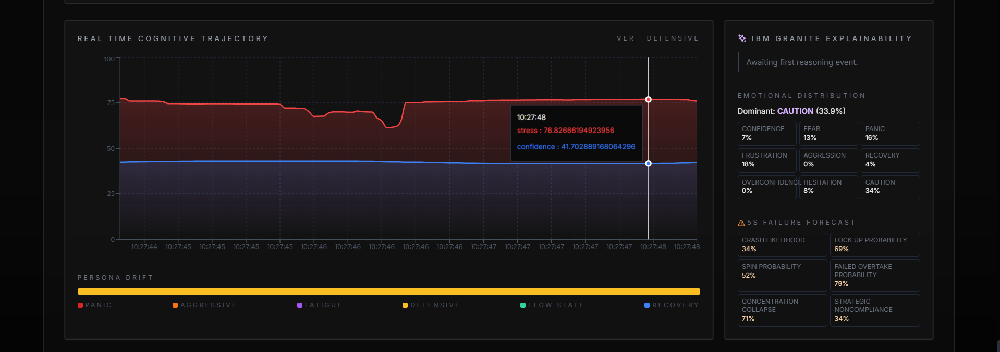
*Real-time cognitive trajectory (stress, confidence, fatigue, panic), live emotional distribution across nine emotions, and a five-second failure forecast (crash / lock-up / spin / failed overtake / concentration collapse / strategic noncompliance) all rendered from live Kafka events.*

---

## IBM AI integration

| Tool | Role in NeuroPit | Where it lives |
| --- | --- | --- |
| **IBM Granite** | Explainable cognitive reasoning. Local Hugging Face inference using `ibm-granite/granite-3.1-8b-instruct` from the [IBM Granite open-source community](https://github.com/ibm-granite-community). No API key required. Watsonx.ai cloud is available as an optional fallback. A deterministic templated stub guarantees Mission Control never goes dark. | [`src/backend/reasoning/granite_client.py`](src/backend/reasoning/granite_client.py) |
| **IBM Docling** | Motorsport cognition knowledge compiler. Ingests FIA reports, neuroscience papers, telemetry manuals, and historical race documents into a Qdrant `motorsport_ontology` collection that grounds every Granite reasoning call. | [`src/backend/knowledge/docling_compiler.py`](src/backend/knowledge/docling_compiler.py) |
| **Langflow** | Reference orchestration flow that visualises the cognitive strategy pipeline. Importable into any Langflow instance. | [`orchestration/langflow/neuropit_strategy_flow.json`](orchestration/langflow/neuropit_strategy_flow.json) |

**Granite is called with physics-first reasoning.** Every score the model sees has already been computed deterministically from engineered features. Granite is strictly forbidden from inventing cognitive numbers. It only explains them. This is what makes the output defensible in a stewards' meeting.

---

## System architecture

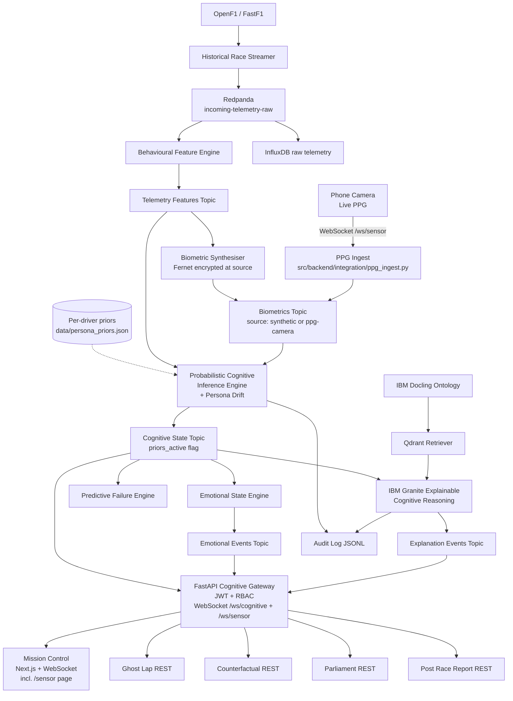

Telemetry flows in on the left. The Cognitive Twin flows out on the right. Every emission carries a confidence band, a written explanation, and an audit trail.

---

## Core capabilities

| Capability | Module |
| --- | --- |
| Behavioural telemetry feature extraction | [`src/backend/feature_engineering/signal_processor.py`](src/backend/feature_engineering/signal_processor.py) |
| Probabilistic Cognitive Inference Engine (nine-score twin) | [`src/backend/inference/cognitive_engine.py`](src/backend/inference/cognitive_engine.py) |
| Emotional State Engine (nine-emotion distribution) | [`src/backend/inference/emotional_state.py`](src/backend/inference/emotional_state.py) |
| Persona Drift state machine with **per-driver priors** trained on real 2021 telemetry | [`src/backend/common/persona.py`](src/backend/common/persona.py), [`src/backend/common/priors.py`](src/backend/common/priors.py) |
| Predictive Failure Engine across four horizons | [`src/backend/prediction/failure_engine.py`](src/backend/prediction/failure_engine.py) |
| Ghost Lap AI (cognitive-normalised laps) | [`src/backend/simulation/ghost_lap.py`](src/backend/simulation/ghost_lap.py) |
| Counterfactual Simulation Engine | [`src/backend/simulation/counterfactual.py`](src/backend/simulation/counterfactual.py) |
| **Live PPG biometric ingestion** from a phone camera | [`src/backend/integration/ppg_ingest.py`](src/backend/integration/ppg_ingest.py), [`src/frontend/app/sensor/page.tsx`](src/frontend/app/sensor/page.tsx) |
| **Cognitive Prescriptive Engine (Optimality Gap + typed actions)** | [`src/backend/prescription/engine.py`](src/backend/prescription/engine.py) |
| **Driver Performance Envelope (per-driver fast-lap signature)** | [`src/backend/prescription/envelope.py`](src/backend/prescription/envelope.py) |
| **Audit-log-driven What-If Replay engine** | [`src/backend/whatif/replay.py`](src/backend/whatif/replay.py) |
| Multi-Agent Strategy Parliament | [`src/backend/strategy/parliament.py`](src/backend/strategy/parliament.py) |
| IBM Granite explainable cognitive reasoning | [`src/backend/reasoning/granite_client.py`](src/backend/reasoning/granite_client.py) |
| IBM Docling motorsport cognition ontology | [`src/backend/knowledge/docling_compiler.py`](src/backend/knowledge/docling_compiler.py) |
| Qdrant retriever for grounded reasoning | [`src/backend/knowledge/retriever.py`](src/backend/knowledge/retriever.py) |
| Trust and uncertainty layer | [`src/backend/common/uncertainty.py`](src/backend/common/uncertainty.py) |
| Audit log per cognitive decision | [`src/backend/common/audit.py`](src/backend/common/audit.py) |
| Post-race intelligence reporting | [`src/backend/reporting/post_race.py`](src/backend/reporting/post_race.py) |
| JWT cognitive gateway with role-based access | [`src/backend/api/gateway.py`](src/backend/api/gateway.py) |
| Fernet biometric encryption at the source | [`src/backend/security/crypto.py`](src/backend/security/crypto.py) |
| Mission Control pit-wall surface | [`src/frontend/app/`](src/frontend/app/) |

---

## Calibrated against real data, not just heuristics

NeuroPit is honest about being a rule-based system rather than a black-box model, but the rules are not arbitrary. Two artefacts shipped in this repository ground the engine against real evidence.

### Per-driver persona priors

The default persona thresholds (Panic, Aggressive, Defensive, Flow, Recovery, Fatigue) used to be a single population-level set applied to every driver. That is wrong: a driver who naturally operates at higher throttle and brake variability looks "stressed" on absolute thresholds even when they are inside their normal envelope, while a calmer driver looks "defensive" on the same thresholds even when pushing hard.

[`scripts/compute_persona_priors.py`](scripts/compute_persona_priors.py) loads a configurable FastF1 session, extracts a stress proxy per lap per driver (throttle and brake variability, normalised mean speed), takes the median across laps, and z-scores each driver against the session median. The z-scores translate into threshold offsets in [`data/persona_priors.json`](data/persona_priors.json). The cognitive engine loads these offsets at startup so each driver gets thresholds shifted by their own operating envelope. Drivers without a prior fall back cleanly to the population default. Every cognitive event carries a `priors_active: true` field so a judge can verify the priors are live from the Kafka topic alone. The 2021 Abu Dhabi race priors that ship by default cover 19 drivers; anyone with FastF1 access can regenerate the artefact for any other session by passing `--year` and `--event`.

### Live PPG biometric ingestion (phone camera)

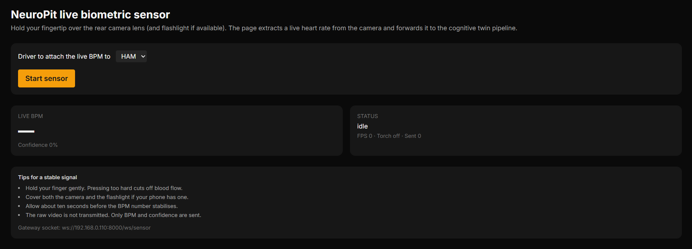
*The `/sensor` page rendered on the laptop for reference. The same page on a phone turns the rear camera into a heart-rate sensor and ships live BPM into the cognitive pipeline.*

The biometric layer is no longer synthetic only. Opening [`/sensor`](src/frontend/app/sensor/page.tsx) on any phone with a rear camera turns that phone into a low-fidelity heart-rate sensor. The browser samples the red channel of the camera at thirty frames per second, detrends against ambient light drift, enforces a refractory period between accepted peaks, and emits a median-smoothed BPM once per second to the gateway over WebSocket. The gateway forwards each sample to the same `biometrics-enriched` Kafka topic the synthetic biometric source publishes to, tagged with `source: "ppg-camera"`. The cognitive engine consumes the topic identically regardless of the source, so the dashboard reacts to your actual heart rate as if it were a synthetic value.

This is documented as a research demo, not a medical-grade device. PPG from a phone camera is noisy and accurate to within roughly five BPM in good conditions. Treat it as proof that the pipeline is end-to-end live, not as a clinical sensor.

### Honest retrospective

[`docs/FAILURE_MODES.md`](docs/FAILURE_MODES.md) lists ten real engineering decisions where the first approach was abandoned or rebuilt during the project. The entries point at specific commits or files. The intent is that anyone reading the final state of the system can see what was rejected and why, not only what shipped.

---

## From diagnostic twin to prescriptive operating system

The Cognitive Twin tells the pit wall *what* is happening inside the driver. The Prescriptive Engine tells the pit wall *what to do about it*, and the What-If Replay engine lets the strategist *defend the call after the fact*. Three tiers, one audit trail, one Granite path.

| Tier | What it produces | Where it lives |
| --- | --- | --- |
| **Diagnostic** | Nine-score Cognitive Twin per evaluation, persona label, emotional distribution, confidence band, Granite paragraph. | `src/backend/inference/`, `src/backend/reasoning/` |
| **Prescriptive** | Cognitive efficiency score (0–100), seconds of laptime left on the table this lap, typed pit-wall action with projected counterfactual twin, ranked alternatives with guardrail status. | `src/backend/prescription/` |
| **Counterfactual** | Audit-log-driven What-If replay. Pick a past window, mutate one input, re-run the deterministic cognitive maths, diff the trajectory. | `src/backend/whatif/` |

The Prescriptive Engine reads each cognitive evaluation, projects it against the **Driver Performance Envelope** (per-driver fast-lap signature in five-dimensional cognitive space, bootstrapped from interpretable persona priors and refined online from the event stream), computes the **Optimality Gap**, scores nine typed actions, vetoes the unsafe ones with hard guardrails, and emits a single primary recommendation alongside ranked alternatives. Every emission is audited. Every emission ships a Granite rationale paragraph grounded in the motorsport ontology.

The What-If Replay engine is grounded in real session data. The cognitive engine has always written every input it saw to a JSONL audit log. The replay engine reads that log back, applies typed mutations to one or more rows (e.g. drop synthetic heart rate to 110, raise throttle commitment to 90, lower steering instability), and re-runs the exact same deterministic cognitive maths over the mutated inputs. The strategist can answer "what would have happened if we had calmed the radio at Silverstone Lap 47" without leaving real data.

Both tiers go through the same JWT-protected gateway, the same WebSocket fan-out, and the same audit log as the diagnostic twin.

### The full nine-score Cognitive Twin

Stress · Confidence · Fatigue · Cognitive Load · Attention Stability · Strategic Reliability · Panic Probability · Emotional Drift · Tunnel Vision

Plus a discrete **persona label** (Panic, Aggressive, Fatigue, Defensive, Flow State, Recovery), a **nine-emotion probability distribution**, and a `high` / `moderate` / `unstable` **confidence band** travelling with every emission.

Every weight, threshold, and assumption is documented in [`docs/COGNITIVE_METHODOLOGY.md`](docs/COGNITIVE_METHODOLOGY.md). The audit log captures the active set of weights on every cognitive event, so old race replays still make sense after the constants move.

---

## Quick start

Requires **Python 3.11+**, **Node 20+**, and **Docker**.

```bash
git clone https://github.com/vighriday/neuropit-may-2026.git
cd neuropit-may-2026
cp .env.example .env

make install
make infra-up           # Redpanda + InfluxDB + Qdrant in Docker
make bootstrap          # Kafka topics + Qdrant collections

make backend            # terminal 1: cognitive pipeline workers
make gateway            # terminal 2: FastAPI cognitive gateway
make stream             # terminal 3: playback historical session

cd src/frontend && npm install && npm run dev
```

Open `http://localhost:3000`. Within ten seconds the cognitive trajectory starts streaming on the pit wall.

---

## Judge quickstart

If you are evaluating NeuroPit for the IBM AI Builders Challenge, this is the shortest possible path to seeing the Cognitive Twin emit live.

**One-command path (recommended).** A single Python script brings up Docker, creates the topics, launches the backend, the gateway, the streamer, and Mission Control. It detects your LAN IP automatically so the live PPG sensor URL works on any phone on the same WiFi without editing config.

```bash
git clone https://github.com/vighriday/neuropit-may-2026.git
cd neuropit-may-2026
python -m pip install -r src/backend/requirements.txt
python scripts/judge_bootstrap.py
```

The script prints the URLs to open. Within roughly thirty seconds you have a live Cognitive Twin on Mission Control, the Granite reasoning panel filling in paragraphs, and the live PPG sensor page ready for any phone on the same network.

To shut everything down: `python scripts/judge_bootstrap.py --down`.

If you see `401 unauthorized` against InfluxDB in the backend logs after the first run (this happens when the docker volumes were initialised by a previous build with a different admin token), wipe the volumes once with `python scripts/judge_bootstrap.py --reset` and then run the bootstrap again.

**Manual path (multi-terminal).** If you prefer to run each piece by hand and watch its logs:

```bash
# 1. one-line setup (Python 3.11+, Node 20+, Docker required)
git clone https://github.com/vighriday/neuropit-may-2026.git && cd neuropit-may-2026 && cp .env.example .env && make install && make infra-up && make bootstrap

# 2. boot the pipeline (run each in its own terminal)
make backend
make gateway
make stream

# 3. boot Mission Control
cd src/frontend && npm install && npm run dev

# 4. open http://localhost:3000
```

> **No `make` on Windows?** Run the raw commands instead. Each `make` target is one line:
>
> ```bash
> python -m pip install -r src/backend/requirements.txt   # make install
> docker compose --env-file .env -f infrastructure/docker-compose.yml up -d   # make infra-up
> python -m src.backend.init_infrastructure                # make bootstrap
> python -m src.backend.run_backend                        # make backend
> python -m src.backend.api.gateway                        # make gateway
> python -m src.backend.ingestion.streamer                 # make stream
> ```

**What to look at, in order:**

1. **Mission Control pit-wall** at `http://localhost:3000` — driver selector, four primary cognitive rings, persona drift strip, IBM Granite reasoning panel.
2. **Reasoning panel** — confirm every paragraph is labelled `via granite-local` and cites motorsport ontology passages.
3. **Live channels** — open `ws://localhost:8000/ws/cognitive` (any WebSocket client) for the live fan-out of cognitive, emotional, anomaly, explanation, and prescription events.
4. **Audit log** — open any file under `audit_logs/cognitive-*.jsonl`. Every event carries its score inputs, the weights used, the model source, and (for explanation rows) the Granite reasoning paragraph.
5. **Per-driver priors active** — every cognitive event on the `cognitive-state-inference` topic carries `priors_active: true`. The weights snapshot in the audit log also records which historical session the priors were calibrated against.
6. **Live PPG biometrics from a phone** — open `http://<your-laptop-LAN-IP>:3000/sensor` on a phone on the same WiFi (the bootstrap script prints the URL). Allow the camera, hold a finger gently over the rear lens, and watch the cognitive twin react to your real heart rate as `source: "ppg-camera"` events land on the `biometrics-enriched` topic alongside the synthetic stream.
7. **Methodology** — every weight is documented in [`docs/COGNITIVE_METHODOLOGY.md`](docs/COGNITIVE_METHODOLOGY.md), and the engineering retrospective lives in [`docs/FAILURE_MODES.md`](docs/FAILURE_MODES.md).

If any step fails, the troubleshooting checklist lives under the FAQ at the bottom of this README.

---

## How NeuroPit maps to the IBM AI Builders Challenge rubric

| Rubric criterion | Where to look |
| --- | --- |
| **IBM Granite usage** | [`src/backend/reasoning/granite_client.py`](src/backend/reasoning/granite_client.py) — Granite 3.0 2B Instruct via Hugging Face by default (drop-in upgrade to Granite 3.1 8B by flipping `GRANITE_MODEL_ID`), ontology-grounded prompts, deterministic stub fallback, watsonx.ai optional path. Every reasoning event ships with its `model_source`. |
| **IBM Docling usage** | [`src/backend/knowledge/docling_compiler.py`](src/backend/knowledge/docling_compiler.py) — compiles FIA reports, neuroscience papers, and racing literature into a Qdrant collection. Retrieved at every Granite call. |
| **Langflow usage** | [`orchestration/langflow/neuropit_strategy_flow.json`](orchestration/langflow/neuropit_strategy_flow.json) — importable visual flow. |
| **Innovation** | Three-tier system: diagnostic Cognitive Twin, prescriptive engine with typed action space and Optimality Gap against a per-driver Performance Envelope, audit-log-driven What-If Replay that lets the strategist re-run real session data under a mutated input. **Live PPG biometric ingestion** from a phone camera as a second source on the same Kafka topic the synthetic source uses. **Per-driver persona priors** calibrated against real 2021 F1 telemetry, loaded at engine startup, audit-flagged on every cognitive event. Nobody else ships this stack. |
| **Technical depth** | Event-driven Redpanda pipeline, InfluxDB time-series persistence, Qdrant vector grounding, FastAPI WebSocket fan-out, JWT + RBAC, Fernet encryption at source, browser-side PPG signal processing (red-channel sampling, refractory peak counting, median smoothing), z-scored per-driver priors from FastF1 telemetry, 195 unit tests, GitHub Actions CI. |
| **Explainability** | Every output ships with a Granite paragraph, a confidence band, a `priors_active` flag, and a JSONL audit row. Physics-first reasoning forbids Granite from inventing cognitive numbers. The engineering retrospective in [`docs/FAILURE_MODES.md`](docs/FAILURE_MODES.md) documents ten rejected approaches with traceable commits. |
| **Impact** | Closes the seven-figure gap between telemetry analytics and driver state. Live PPG path proves the architecture is not synthetic-only and generalises to any wearable signal. Generalises to aviation, defence, surgery, esports, and elite athletics. |
| **Demo readiness** | One Python command (`python scripts/judge_bootstrap.py`) brings up Docker, topics, backend, gateway, streamer, and Mission Control. Mission Control pit-wall shows the Cognitive Twin emitting within ten seconds of stream start. The `/sensor` page is one nav tap away. |
| **Open source posture** | Apache 2.0. Contributor Covenant 2.1 code of conduct. Security policy (including the deliberate unauthenticated `/ws/sensor` posture choice). Contributing guide. PR template enforcing methodology updates. CI on every push. |

---

## Demo path

The Judge Quickstart above takes you to a live Mission Control. Once the stream is running, the dashboard tells its own story in four panels.

### 1. Cognitive Twin populates

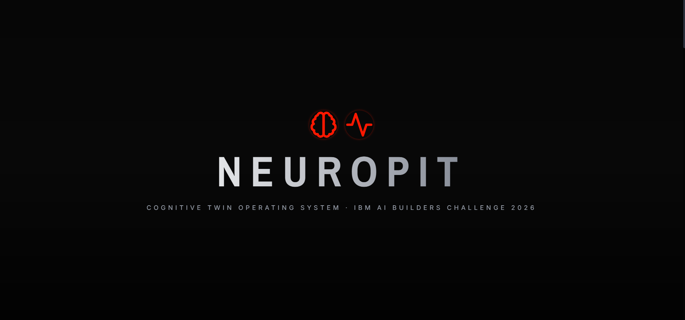
*The scroll narrative introduces NeuroPit before the live pit wall comes into view. The full Mission Control surface appears once you scroll past the third scene.*

### 2. Prescriptive Engine

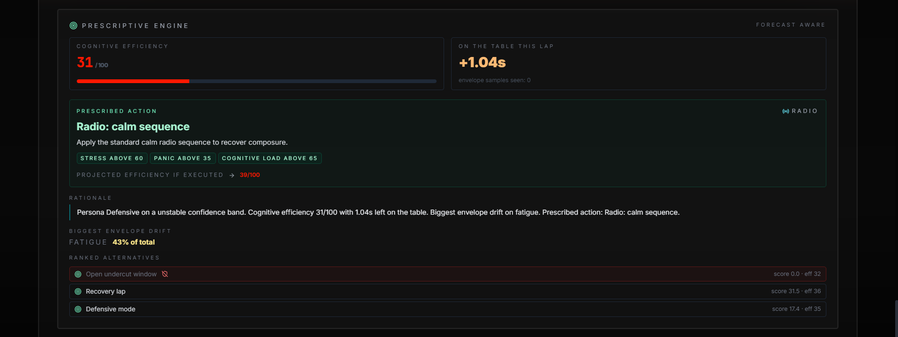
*The Prescriptive Engine emits a cognitive efficiency score, the seconds on the table this lap, the prescribed pit-wall action (with the triggers that fired), the projected post-action twin, and a ranked list of alternatives. Guardrail-blocked actions sink to the bottom of the list.*

### 3. What-If Replay

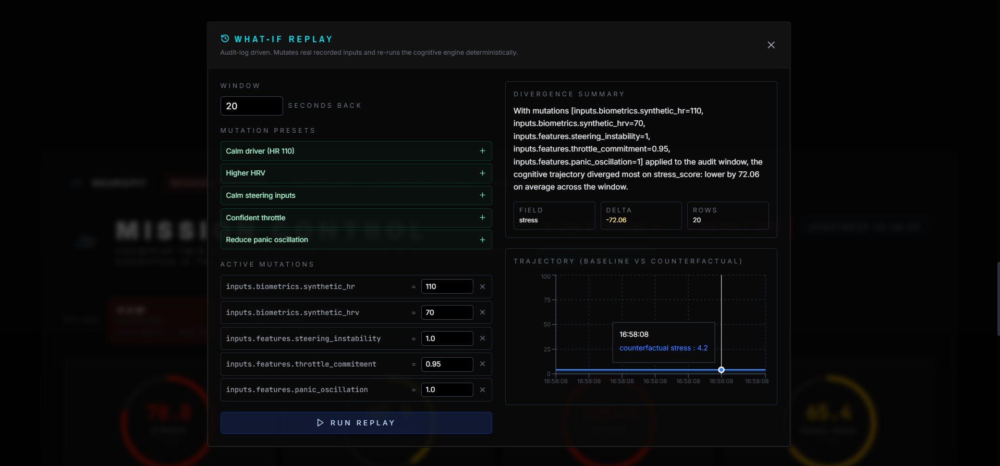
*The What-If drawer mutates a real audit row and re-runs the cognitive maths deterministically. Here, dropping the driver's heart rate to 110 bpm and trimming steering instability collapses stress by 72 points.*

### 4. IBM Granite explainability

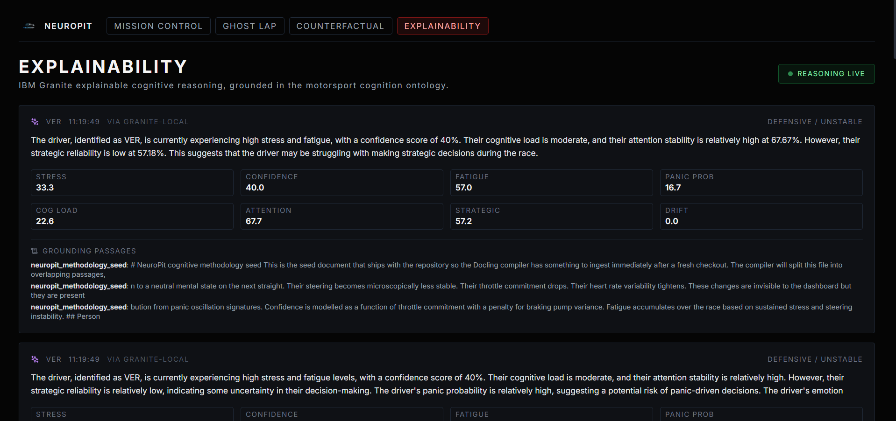
*Every cognitive evaluation gets a short paragraph from Granite 3.0 2B Instruct, grounded in passages retrieved from the IBM Docling compiled motorsport ontology. Each paragraph carries its `via granite-local` source label.*

A minute-by-minute run order judges or recruiters can follow without you in the room lives in [`docs/DEMO.md`](docs/DEMO.md).

### Diagnostic side panels

| Ghost Lap (cognitive lost time) | Counterfactual scenarios |
| --- | --- |
| 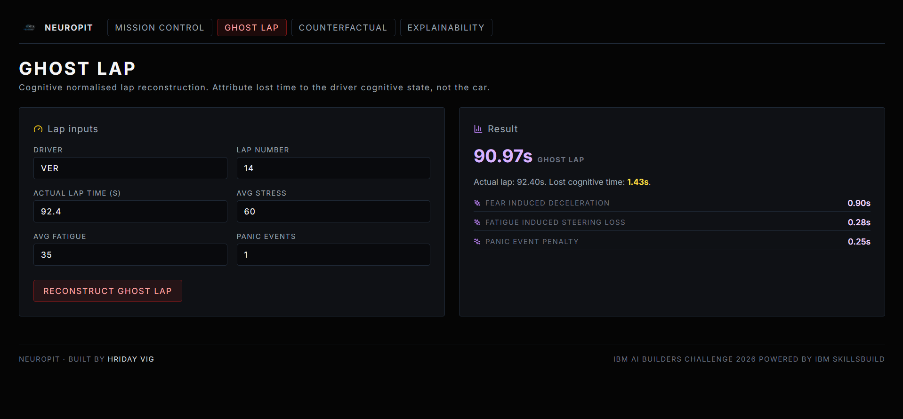 | 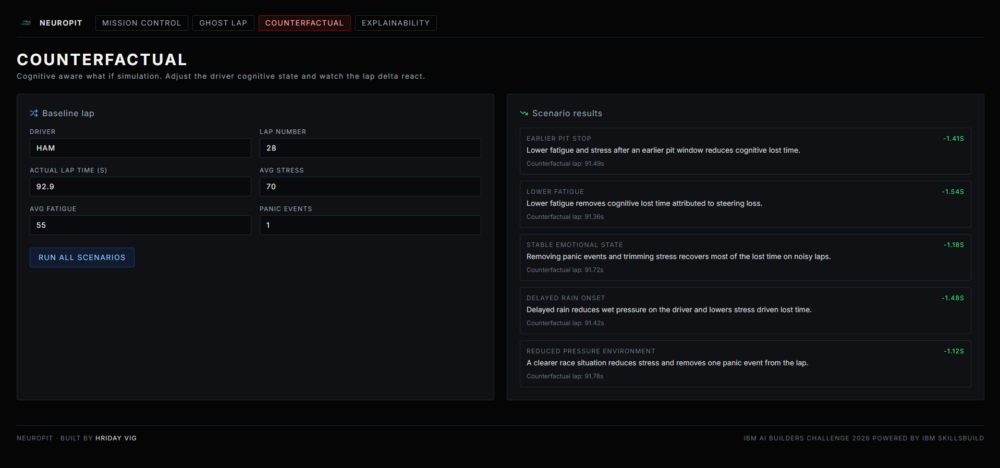 |

---

## Tech stack

| Layer | Technology |
| --- | --- |
| Frontend | Next.js 14, React 18, TypeScript, Tailwind, Recharts, Lucide |
| Gateway | FastAPI, WebSocket, JWT (`python-jose`), Fernet (`cryptography`) |
| Cognitive pipeline | Python 3.12, NumPy, SciPy, scikit-learn |
| Streaming | Redpanda (Kafka compatible), `confluent-kafka` |
| Time series | InfluxDB 2 |
| Vector store | Qdrant + sentence-transformers |
| Reasoning | IBM Granite via Hugging Face transformers (local) or watsonx.ai (cloud) |
| Knowledge | IBM Docling |
| Orchestration | Langflow reference flow |
| Telemetry source | OpenF1 + FastF1 |
| Live biometrics | Browser camera PPG (red channel sampling, refractory peak counting, median smoothing), streamed to the gateway over WebSocket |
| Per-driver calibration | Real F1 telemetry priors (z-scored persona threshold offsets) computed from FastF1, loaded at engine startup |
| Tests | pytest, 195 unit tests, integration tests gated on infra |
| CI | GitHub Actions on every push and pull request |

### Live proof of every tier

| FastAPI Swagger | Redpanda Kafka topics |
| --- | --- |
| 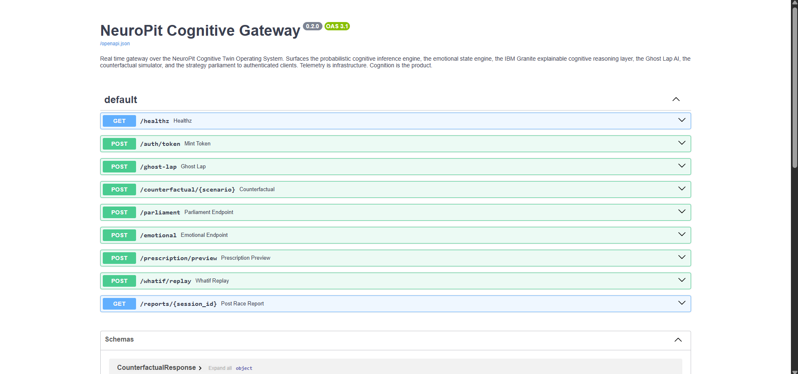 | 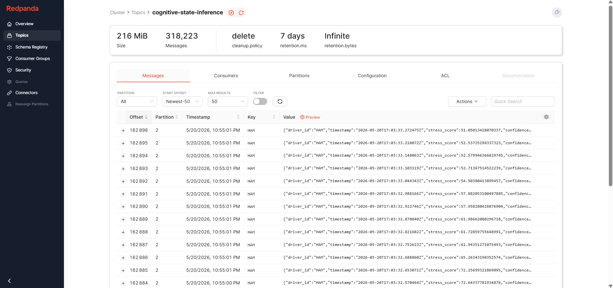 |
| Every protected REST route, OpenAPI 3.1 schemas, JWT-aware. | Live `cognitive-state-inference` topic with 318k+ messages during a session replay. |

| Qdrant motorsport ontology | InfluxDB time-series cognitive scores |
| --- | --- |
| 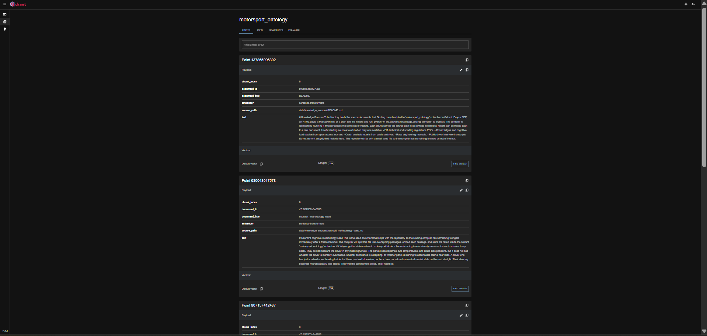 | 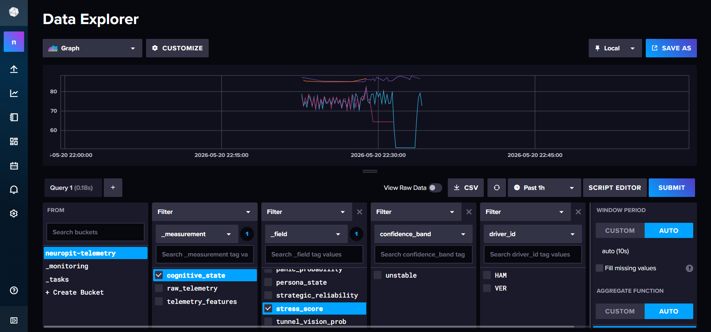 |
| Real `sentence-transformers/all-mpnet-base-v2` embeddings of the IBM Docling compiled methodology seed. | Cognitive engine writes per-driver scores to `neuropit-telemetry` for replay and post-race analysis. |

### Backend tier layout

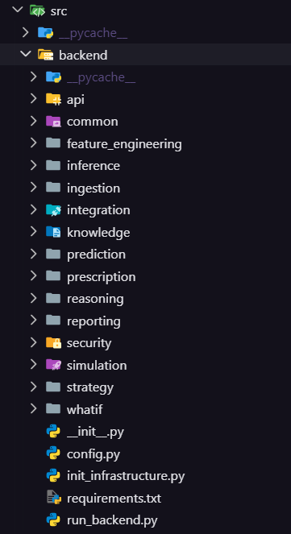
*Six runtime tiers in `src/backend/`: `inference` (Cognitive Twin), `prescription` (Prescriptive Engine), `whatif` (audit-log replay), `reasoning` (Granite + Docling + Langflow), `prediction` (Predictive Failure Engine), and `security` (JWT + RBAC + Fernet).*

---

## Security and trust

NeuroPit runs on real driver-state inference. Trust is part of the contract.

- **Encryption at source.** Biometric channels are Fernet-encrypted before they hit Kafka. The key lives in `.env`, never in code.
- **JWT + RBAC.** The cognitive gateway enforces four roles: Team Principal, Race Strategist, Driver Engineer, Neuro Analyst. Every WebSocket subscription and REST call validates the role and required scopes.
- **Audit before broadcast.** Every cognitive evaluation, prescription, and what-if replay is appended to `audit_logs/cognitive-*.jsonl` before the matching Kafka or WebSocket emit. If the audit append raises, the emit is skipped and the engine logs the drop.
- **Confidence bands, always.** No output ever leaves the engine without a `high` / `moderate` / `unstable` band attached.
- **Physics-first reasoning.** Granite is shown precomputed scores. It cannot invent cognitive numbers.

Vulnerability disclosure procedure lives in [`SECURITY.md`](SECURITY.md).

---

## Tests

```bash
make test              # 195 unit tests, no infrastructure required
make integration       # integration smoke tests, requires Redpanda running
```

CI runs the backend unit suite, the import smoke, and the frontend type check on every push and every pull request.

---

## Roadmap

- **Phase 1 (shipped, v0.3.0)** — Full nine-score Cognitive Twin, Emotional State Engine, all architectural layers, JWT gateway, Mission Control surface, OSS hygiene, GitHub Actions CI.
- **Phase 1.5 (shipped, current build)** — Per-driver persona priors trained on real 2021 F1 telemetry, live PPG biometric ingestion from a phone camera into the same Kafka topic the synthetic source uses, one-command judge bootstrap, engineering retrospective in `docs/FAILURE_MODES.md`.
- **Phase 2** — Statistical adaptation. Rolling baselines beyond the per driver priors, telemetry normalisation, adaptive thresholds that learn during a session rather than load once.
- **Phase 3** — Learned behavioural models. Lightweight temporal classifiers on the existing feature inputs without changing the cognitive twin output contract.
- **Phase 4** — Multimodal cognitive transformer. Reinforcement learning. Wearable grade biometrics (chest strap, ECG patch) replacing the phone PPG path with a clinical signal.

The architecture is built so each phase swaps the inference function without rewriting the surface contract.

---

## FAQ

**Why infer the driver instead of optimising the car?**
Every Formula team already pays seven figures a year to optimise the car. None of them ship a defensible real-time twin of the human operating it. The category is open and the impact compounds across every high-stakes human-machine domain.

**Why a probabilistic engine instead of a deep network?**
A hackathon-trained neural network on synthetic data looks like AI on the slide deck but is impossible to defend in a code review. A weighted probabilistic engine is honest about what it knows. Every weight is documented in [`docs/COGNITIVE_METHODOLOGY.md`](docs/COGNITIVE_METHODOLOGY.md). Phase 3 of the roadmap swaps the inference function for a learned model without changing the output contract.

**Why physics-first reasoning?**
Granite is a generative model. If a strategist is going to defend a pit call against a steward, they cannot defend a number a generative model invented. Granite is shown precomputed deterministic scores and reasons over them. It explains. It does not generate the score.

**Do I need watsonx credentials?**
No. The default Granite path is local Hugging Face inference of `ibm-granite/granite-3.0-2b-instruct` (around 4 GB on disk, fits on a 16 GB workstation). To upgrade to the 8B model, set `GRANITE_MODEL_ID=ibm-granite/granite-3.1-8b-instruct` in `.env` and re-run `python scripts/download_granite.py`. Watsonx.ai is an optional cloud fallback. The deterministic templated stub is a third fallback so Mission Control never goes dark.

**Where do biometrics come from?**
Two sources, distinguishable by the `source` field on the `biometrics-enriched` Kafka topic. The default source is the biometric synthesiser, which conditions heart rate, HRV, and respiration on telemetry features and tags every event with `source: "synthetic"`. The synthetic stream is Fernet encrypted at write. The second source is the live PPG ingestion path: opening `/sensor` on a phone turns the rear camera into a low fidelity heart rate sensor and ships live BPM into the same topic tagged with `source: "ppg-camera"`. The cognitive engine joins both sources against the feature topic identically; the source tag is the only thing that distinguishes them. Phase 4 of the roadmap swaps the phone PPG for a clinical wearable signal.

**What happens if Redpanda, InfluxDB, or Qdrant is offline?**
Every consumer gracefully degrades to "no grounding available" or "skipped" rather than crashing. The cognitive engine still emits the deterministic twin. The audit log still writes. Mission Control still updates over the heartbeat channel.

**Troubleshooting checklist.**
- `make infra-up` failed → check `docker compose ps`, ensure ports 9092, 8086, 6333 are free.
- Mission Control shows `awaiting cognitive stream` for more than thirty seconds → check `make stream` is running and `make backend` did not exit.
- Granite reasoning shows `via stub` → set `GRANITE_USE_LOCAL=true` in `.env` and let the model download finish on first run.
- Reasoning panel empty → Qdrant collection not bootstrapped. Run `make bootstrap` again.

---

## Documentation

- [Architecture](docs/ARCHITECTURE.md) — six tiers, how a frame travels through the system.
- [Cognitive methodology](docs/COGNITIVE_METHODOLOGY.md) — every weight, every threshold, the reasoning behind each one, including the Driver Performance Envelope and the What-If replay contract.
- [Event taxonomy](docs/EVENT_TAXONOMY.md) — every Kafka topic, its payload shape, producers, consumers.
- [Demo script](docs/DEMO.md) — minute-by-minute walkthrough of the live pit wall.
- [Failure modes](docs/FAILURE_MODES.md) — honest retrospective of approaches that were tried and either abandoned or rebuilt during the project.
- [Data directory](data/README.md) — per-driver persona priors artifact, knowledge sources for the Docling compiler.
- [Contributing](CONTRIBUTING.md)
- [Security policy](SECURITY.md)
- [Code of conduct](CODE_OF_CONDUCT.md)

---

## Licence

Apache 2.0. Copyright 2026 Hriday Vig. See [`LICENSE`](LICENSE) and [`NOTICE`](NOTICE) for attributions.

---

## Author

**Hriday Vig** · [github.com/vighriday](https://github.com/vighriday) · `vighriday@gmail.com`

NeuroPit was conceived, designed, and built solo by Hriday Vig for the **IBM AI Builders Challenge 2026 — Racing Innovation Challenge**, powered by IBM SkillsBuild. The architecture, the methodology, the surface, and the open-source posture are the work of one builder.

If you are a recruiter, a judge, or a Formula team interested in the Cognitive Twin Operating System category, the inbox is open.

---

## Acknowledgements

NeuroPit stands on the shoulders of [FastF1](https://github.com/theOehrly/Fast-F1), [OpenF1](https://openf1.org), [IBM Granite](https://github.com/ibm-granite-community), [IBM Docling](https://www.docling.ai), [Langflow](https://www.langflow.org), [Redpanda](https://redpanda.com), [InfluxDB](https://www.influxdata.com), [Qdrant](https://qdrant.tech), [FastAPI](https://fastapi.tiangolo.com), and [Next.js](https://nextjs.org). Every third-party component is attributed in [`NOTICE`](NOTICE).

---

<div align="center">

**NeuroPit · Built solo by Hriday Vig · IBM AI Builders Challenge 2026 · powered by IBM SkillsBuild**

*Telemetry is infrastructure. Cognition is the product.*

</div>
